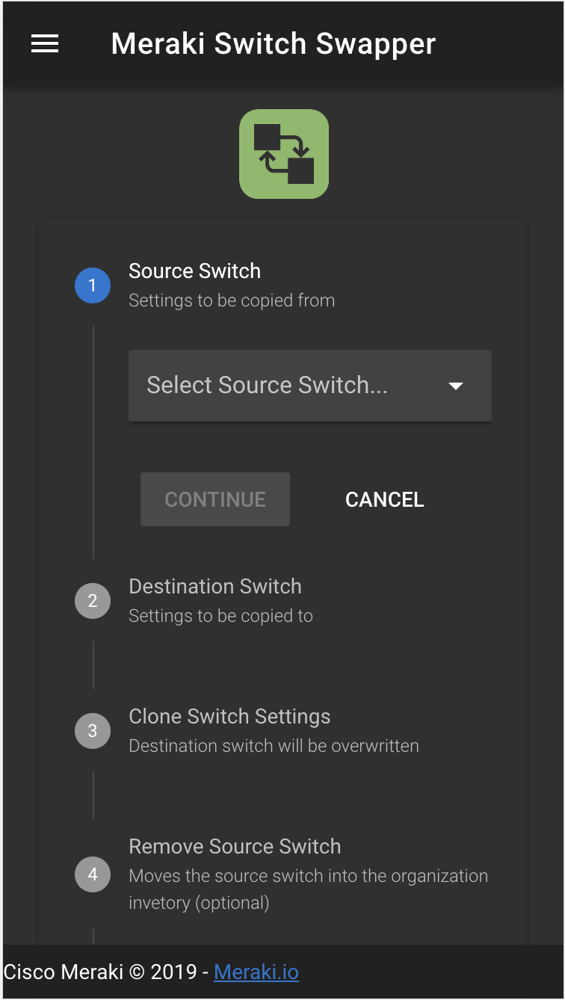

# meraki-swapper

> A web tool for swapping Meraki switches

# About
This web application is a simple tool to streamline replacing Meraki switches with a similar switch. It can also be installed as a PWA for a more native feel on mobile devices.



---

[Live DEMO](https://meraki-swapper.dexterlabora.now.sh)
    


---

## Features
- Organization selector
- Select source and destination switches
- Add a new switch into the source network from the organization inventory
- Clone switch details and all port settings to destination switch
- Remove source switch from network, which is then returned to the inventory
- All API requests are made server side, avoiding any API keys leaking to the client
  

## Build Setup

``` bash
# install dependencies
$ yarn install

# serve with hot reload at localhost:3000
$ yarn dev

# serve with API Key and Meraki API base URL
$ NUXT_ENV_API_KEY=<your-api-key> NUXT_ENV_API_URL="https://api.meraki.com/api/v0" yarn dev


# build for production and launch server
$ yarn build
$ yarn start

#generate static project
$ yarn generate
```

#  Dev Info

[NUXT Folder Structure Details](https://nuxtjs.org/guide/directory-structure)

## Configuration Files
```
# Theme and app configuration
nuxt.config.js

# Meraki API configurations
meraki.config.js
```

## Important App Files
```
# Pages ~ Start of app and dynamically routed pages
pages/index.vue

# Layout ~ Menu / Toolbar
layouts/default.vue

# Switch Swapper ~ Form and primary logic flow
components/SwapForm.vue

# Components ~ All of the actions and views 
components/... 

# Routes ~ API Proxy Route for Meraki API
api/routes/meraki.js

```

# Deployment Options
The app has been configured to be easily deployed in a few popular free/budget locations.

## Now
https://zeit.co/now

```
NUXT_ENV_API_KEY=<APIKEY> NUXT_ENV_API_URL="https://api.meraki.com/api/v0" now
```

## Heroku
https://nuxtjs.org/faq/heroku-deployment/

```bash
# Login to Heroku and Clone your project (create from heroku.com)
heroku login
heroku git:clone -a meraki-swapper
cd meraki-swapper

# Set environment variables, including Meraki API key (or from the website add the environment variable)
heroku config:set NPM_CONFIG_PRODUCTION=false
heroku config:set HOST=0.0.0.0
heroku config:set NODE_ENV=production
heroku config:set NUXT_ENV_API_KEY=<your Meraki API key>
heroku config:set NUXT_ENV_API_URL="https://api.meraki.com/api/v0"

# Deploy Changes
$ git add .
$ git commit -am "make it better"
$ git push heroku master
```


## Built with
- [Nuxt.js / Vue.js](https://nuxtjs.org)
- [Vuetify](https://vuetifyjs.com)
- [Meraki API](https://meraki.io/api)
- [Node v10.13.0](https://nodejs.org/en/)

MerakiSwitchSwapper-screenshot.png